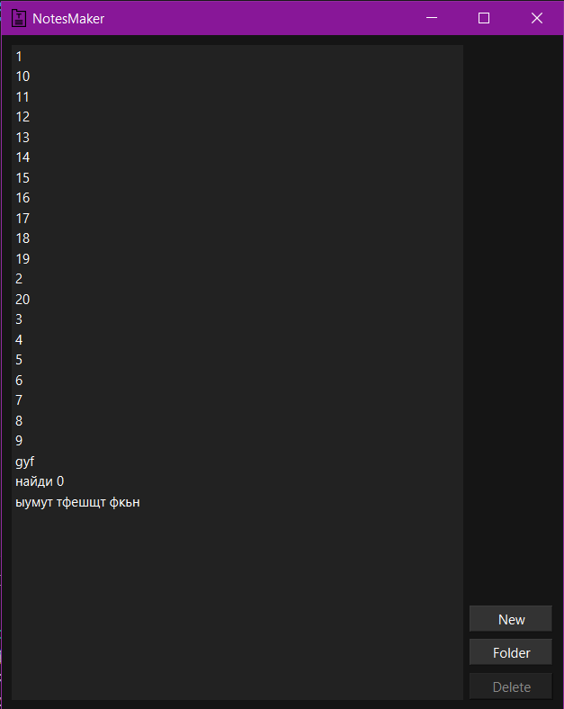
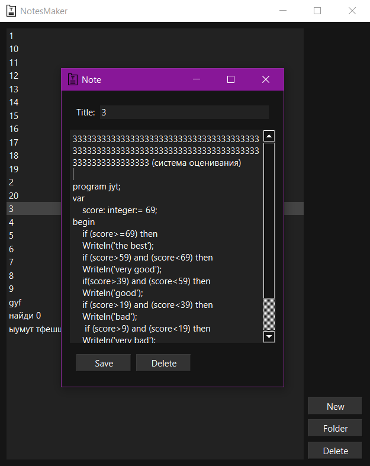

# Notes Maker

## About

Этот проект представляет собой приложение для создания и управления текстовыми заметками с графическим интерфейсом, разработанное на Python с использованием библиотеки PyQt6. Приложение позволяет создавать, редактировать, сохранять и удалять заметки в выбранной пользователем папке.

<div align="center">
  

  
</div>

### Особенности приложения

- **Темная тема интерфейса** с удобной навигацией
- **Полноценная работа с текстовыми файлами**:
  - Создание новых заметок
  - Редактирование существующих
  - Автоматическое сохранение при изменении
  - Удаление заметок
- **Гибкая система именования**:
  - Автоматическое присвоение имен новым заметкам (UntitledNote_1, UntitledNote_2 и т.д.)
  - Возможность ручного изменения названия заметки
- **Поддержка разных кодировок**:
  - Автоматическое определение кодировки файла (UTF-8 или CP1251)
- **Удобное управление**:
  - Подсветка элементов интерфейса при наведении
  - Двойной клик для открытия заметки
  - Контекстное включение кнопки удаления

### Интерфейс

Приложение состоит из двух основных окон:

1. **Главное окно**:

   - Список всех заметок в выбранной папке
   - Кнопки:
     - "New" - создание новой заметки
     - "Folder" - выбор рабочей папки
     - "Delete" - удаление выбранной заметки

2. **Окно заметки**:

   - Поле для редактирования названия
   - Текстовое поле для содержимого
   - Кнопки:
     - "Save" - сохранение изменений
     - "Delete" - удаление текущей заметки

### Технические детали

- **Язык программирования**: Python 3
- **Графическая библиотека**: PyQt6
- **Формат хранения**: Текстовые файлы (.txt)
- **Поддерживаемые кодировки**: UTF-8, CP1251

## Installation

0.  **Клонирование репозитория:**

    Перед тем как начать, вам необходимо клонировать репозиторий с исходным кодом проекта.

    ```bash
    git clone https://github.com/UmbrellaLeaf5/template_python_usual.git
    ```

    Перейдите в директорию, куда был клонирован репозиторий:

    ```bash
    cd template_python_usual
    ```

1.  **Создание виртуального окружения:**

    Откройте терминал или командную строку в корневой директории вашего проекта (там, где находится файл `requirements.txt`) и выполните следующую команду для создания виртуального окружения с именем `.venv`:

    ```bash
    python3 -m venv .venv
    ```

    или

    ```bash
    python -m venv .venv
    ```

    - Если у вас установлена только версия `Python 3`, можете использовать `python` вместо `python3`.
    - Если виртуальное окружение уже существует (вы его создавали ранее), пропустите этот шаг.

2.  **Активация виртуального окружения:**

    Активируйте виртуальное окружение, чтобы `Python` использовал библиотеки, установленные внутри него:

    - **Linux/macOS:**

      ```bash
      source .venv/bin/activate
      ```

    - **Windows (Command Prompt):**

      ```cmd
      .venv\Scripts\activate
      ```

    - **Windows (PowerShell):**

      ```powershell
      .venv\Scripts\Activate.ps1
      ```

    После активации вы увидите `(.venv)` в начале строки терминала, указывающее на то, что виртуальное окружение активно.

3.  **Установка зависимостей из `requirements.txt`:**

    Установите все библиотеки, перечисленные в файле `requirements.txt`, выполнив следующую команду:

    ```bash
    ./.venv/Scripts/pip install -r requirements.txt
    ```

    или просто:

    ```bash
    pip install -r requirements.txt
    ```

**Или просто используйте [`uv`](https://github.com/astral-sh/uv):**

```bash
uv venv .venv
```

- **Linux/macOS:**

  ```bash
  source .venv/bin/activate
  ```

- **Windows (Git Bash):**

  ```bash
  source .venv/Scripts/activate
  ```

- **Windows (Command Prompt):**

  ```cmd
  .venv\Scripts\activate
  ```

- **Windows (PowerShell):**

  ```powershell
  .venv\Scripts\Activate.ps1
  ```

```bash
uv pip install -r requirements.txt
```

P.S. одной строкой:

```bash
uv venv .venv && source .venv/Scripts/activate && uv pip install -r requirements.txt
```
